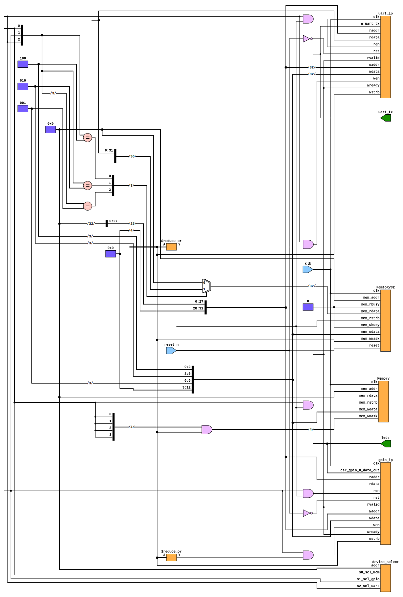

# RISC-V SoC on Tang Nano 9K

This repository contains a custom RISC-V-based System-on-Chip (SoC) implemented on the Tang Nano 9K FPGA. It utilizes PicoRV32 and FemtoRV32 cores along with UART communication and runs a dedicated firmware. 

## Features
- **RISC-V Cores**: Supports both [PicoRV32](https://github.com/cliffordwolf/picorv32) and [FemtoRV32](https://github.com/BrunoLevy/learn-fpga) cores.
- **UART Interface**: Implemented for serial communication.
- **FPGA Platform**: Designed for the Tang Nano 9K FPGA.
- **Custom Firmware**: Runs its own dedicated `firmware.hex`.
- **Simulation and Debugging**: Uses TerosHDL (via OSS-CAD Suite), Corsair, and GTKWave.
- **Build System**: Utilizes `make` for firmware compilation.

## Directory Structure
```
RISC-V-SoC/
├── firmware/          # C-based firmware for the SoC
│   ├── inc/          # Header files
│   ├── src/          # Source files
│   ├── firmware.hex  # Compiled firmware in hex format
│   ├── Makefile      # Build system
│   ├── main.c        # Entry point for firmware
│   ├── start.S       # Startup assembly code
│   └── sections.lds  # Linker script
│
├── firmware_asm/      # Assembly-based firmware (if applicable)
│
├── riscv_soc_fpga_tang_nano_9k/  # FPGA project files
│   ├── impl/         # Implementation files (synthesis, P&R, temp)
│   ├── src/          # Source code for FPGA
│   └── gowin_rpll/   # PLL configuration files for Gowin FPGA
│
├── src/              # SoC hardware design files
│   ├── picorv32.v    # PicoRV32 core
│   ├── femtorv32_quark.v  # FemtoRV32 core
│   ├── uart_ip.v     # UART module
│   ├── gpio_ip.v     # GPIO module
│   ├── Memory.v      # Memory module
│   ├── top.v         # Top-level module
│   ├── device_select.v # Core selection logic
│   └── regs_uart.v   # UART register file
```

## Top-Level Schematic
Below is the top-level schematic of the SoC implemented on the FPGA:



## Setup & Usage
### Prerequisites
- Install [OSS-CAD Suite](https://github.com/YosysHQ/oss-cad-suite-build)
- Install [Gowin IDE](https://www.gowinsemi.com/) for Tang Nano 9K
- Install [Make](https://www.gnu.org/software/make/) for firmware compilation
- Install the RISC-V toolchain using:
  ```sh
  ./toolchain-installation.sh
  ```
- Refer to [IDE Installation Guide](ide-installation.md) for setting up TerosHDL and OSS-CAD Suite.

### Building the Firmware
```sh
cd firmware
make
```
This will generate `firmware.hex`, which can be loaded onto the SoC.

### Running the SoC on FPGA
1. Open Gowin IDE and load the project from `riscv_soc_fpga_tang_nano_9k`.
2. Run synthesis, place & route, and generate the bitstream.
3. Upload the generated bitstream to the Tang Nano 9K.
4. Load `firmware.hex` into the memory.
5. Use a serial terminal (e.g., PuTTY or Minicom) to interact with the SoC via UART.

## Simulation
- Use TerosHDL and GTKWave for simulation.
- Run the testbench with:
  ```sh
  vvp testbench.vvp
  ```
  and visualize waveforms in GTKWave.
